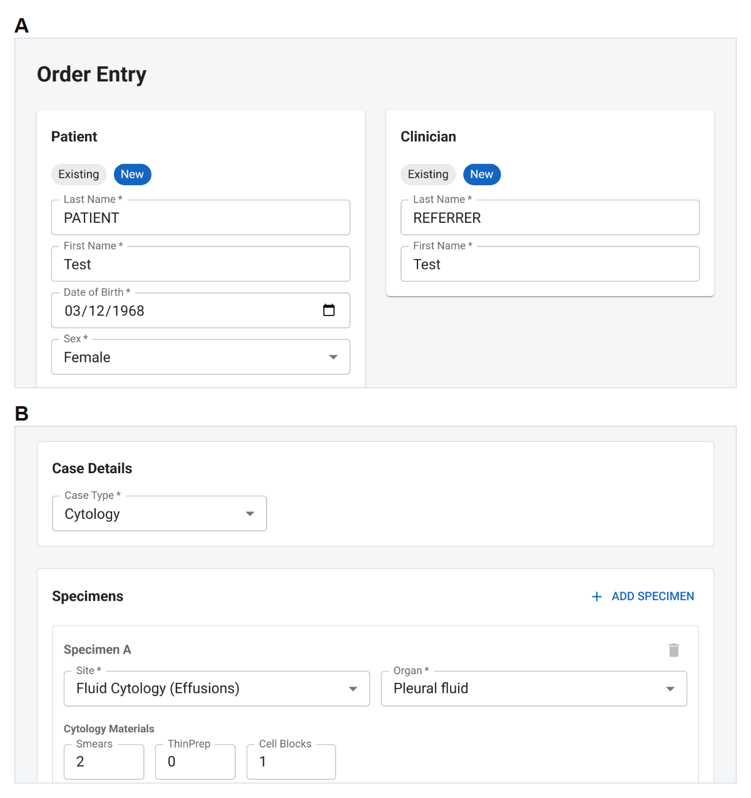
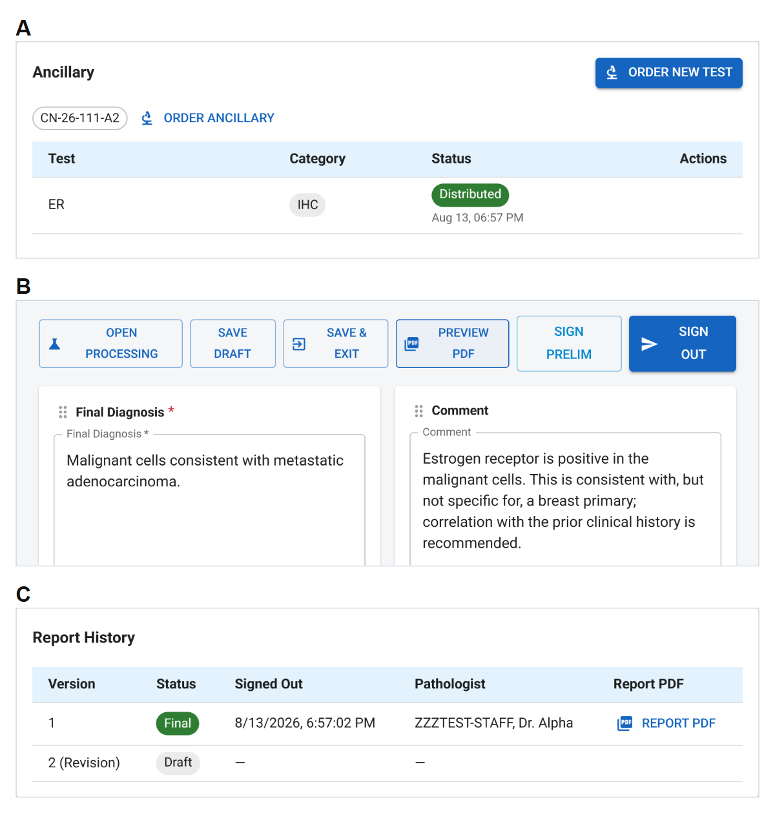
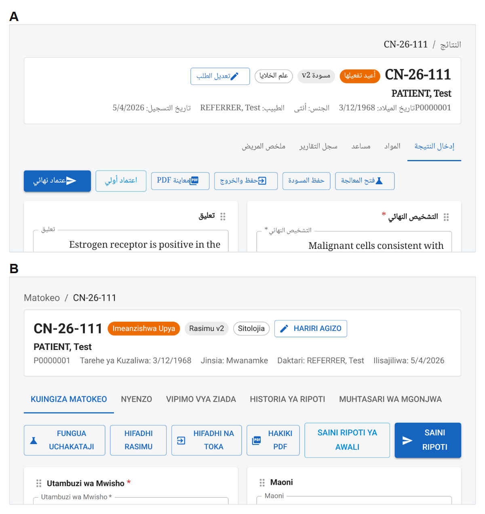

# Lightweight AP LIS

A lightweight **Anatomic Pathology Laboratory Information System** — accessioning
through sign-out — built for laboratories that need structured pathology reporting
without an enterprise LIS budget.

It runs the whole case: accession a specimen, document gross processing, track the
blocks and slides it produces, order ancillary studies, author a structured report,
sign it out, and amend it afterwards without losing what was originally released. The
interface is available in six languages, including right-to-left rendering for Arabic
and Urdu, and the whole stack comes up with one `docker compose up`.

This is the software artifact behind a manuscript on pathology informatics in
resource-constrained settings. See [Status and scope](#status-and-scope) before
deploying it anywhere near patient care.

## The case, end to end

The figures below are the manuscript figures, rendered from the same layout at screen
resolution. **Every value shown is synthetic** — patients, clinicians and pathologists
are deterministic fabricated records, and the identifiers and dates are generated by
the application from that synthetic input.

**Structured cytology accessioning.** (A) Entry of patient and referring-clinician
information. (B) Selection of case type, specimen site, organ and cytology preparation
details.



**Ancillary testing, diagnostic reporting and report-version governance.** (A) An
immunohistochemical study linked to its originating tissue block and tracked through an
explicit workflow state. (B) Structured result entry and report-authorization controls
for the same case. (C) Report history preserving the original finalized report and PDF
while representing a subsequent revision as a separate draft version.



**Multilingual pathology-reporting interfaces.** The same case in (A) Arabic and
(B) Kiswahili, with case identifiers, report-version state and workflow controls
consistent across languages. The application translates the interface and its
structured fields, not narrative text — which is why the diagnosis and comment appear
in the language the pathologist entered them in.



These three are a subset. The full figure set — including patient-facing summaries,
reporting-template configuration and the ancillary catalog — is generated by
`pnpm figures:compose`; see [Reproducing the paper's numbers](#reproducing-the-papers-numbers).
Provenance and checksums for the images above are in
[docs/images/README.md](docs/images/README.md).

## What it does

Counts below are measured from the repository by `pnpm metrics:system` and recorded in
[docs/verification/system-characteristics.md](docs/verification/system-characteristics.md).

- **Accessioning and material tracking.** Patients, referring clinicians, specimens,
  case types and sites. Identifiers are deterministic and hierarchical — case →
  specimen → block → slide — so a slide label states its own provenance.
- **Structured reporting.** 35 reporting templates: 9 gross examination, 19 CAP-aligned
  microscopic, and 7 cytology (Bethesda, Milan, Paris, Yokohama). Templates are
  JSON-backed and editable from the interface, independently of the workflow code.
- **Ancillary testing.** 27 individual immunohistochemistry orderables and 12
  preconfigured panels, across IHC, molecular, special stains, send-outs and H&E
  levels, each linked to the block it was ordered from.
- **Report versioning.** Preliminary and final sign-out, then amendment. A finalized
  report and its PDF are preserved when a revision begins; the revision is a separate
  version, not an overwrite.
- **PDF reports** rendered from configurable Handlebars layouts through Puppeteer.
- **Six languages** — English, Kiswahili, French, Portuguese, Arabic and Urdu — with
  right-to-left layout for Arabic and Urdu, from curated translation resources rather
  than machine translation.
- **Patient-facing summaries** generated deterministically from the structured
  diagnostic category, in the same six languages.
- **Three roles** — Pathologist, Technologist, Administrator — with writes enforced
  server-side; see [Roles and authorization](#roles-and-authorization).
- **CSV roster import** for patients, referring clinicians and staff, validated whole
  before anything is written.
- **18 relational entities** across 22 tables, with a deterministic 300-case synthetic
  corpus for demonstration and testing.

## Status and scope

This is a **research prototype**, released to accompany a manuscript. It has not been
validated for clinical use, carries no regulatory clearance, and has not been through
a laboratory accreditation process. Nothing here should be used to produce a
diagnostic report on a real patient — see [License](#license) for the terms and the
adopter's responsibilities.

What that means in practice:

- The synthetic corpus is fabricated, and `DEMO_MODE` marks it as such on screen and
  on every generated PDF — see [Demo-data marking](#demo-data-marking).
- Performance, resource and coverage figures are measured rather than estimated, and
  the measurements name the run and the machine that produced them. Where a claim is
  not backed by a measurement, it is not made; see
  [docs/verification/manuscript_verification_section.md](docs/verification/manuscript_verification_section.md),
  which also records the defects the verification pass found.

## Stack

| Layer | Technology |
|---|---|
| Backend | Node.js · Express · TypeScript · Prisma |
| Database | PostgreSQL |
| Frontend | React · Vite · TypeScript · MUI v5 |
| API data | TanStack Query (React Query) |
| Validation | Zod (shared schemas) |
| PDF generation | Handlebars + Puppeteer (HTML report layout) · pdf-lib (legacy) |
| Session auth | express-session |
| Testing | Vitest · React Testing Library · Playwright |
| CI/CD | GitHub Actions |
| Local dev | Docker Compose |

## Prerequisites

- Node.js 22+
- pnpm 11+ (`corepack enable && corepack prepare pnpm@11 --activate`). The repo is a pnpm workspace (`pnpm-workspace.yaml`) and CI runs the pnpm-lock.yaml under `pnpm install --frozen-lockfile`.
- Docker (for containerized run) or PostgreSQL 16+ (for local dev)

## Quick start — Docker Compose

This repo ships **two Compose stacks**:

| Stack | File(s) | Database | Use for |
|---|---|---|---------|
| **Development** (default) | `docker-compose.yml` (optionally `+ docker-compose.dev.yml` for Vite HMR) | Containerized PostgreSQL | Local development, demos, CI |
| **Production** | `docker-compose.prod.yml` (standalone) | Local PostgreSQL primary + hot-standby replica | Real deployments |

The two stacks share the same backend/frontend images and code. **The only difference is the database wiring** — dev runs Postgres in a container; prod connects to a managed Cloud SQL instance through an Auth Proxy sidecar. Bring one stack down before starting another so they do not compete for container names and ports.

### Dev path 1. Base Compose stack (`docker-compose.yml`)

```bash
# Copy and review environment variables
cp .env.development.example .env

# Start all services (PostgreSQL, backend, frontend)
docker compose -f docker-compose.yml up --build
```

The frontend will be available at **http://localhost:5173**  
The backend API at **http://localhost:3001**

This stack will automatically:
1. Start PostgreSQL
2. Run Prisma migrations (`prisma migrate deploy`)
3. Seed the database with 300 synthetic cases (deterministic; see `pnpm db:characterize`)
4. Start the backend and serve the built frontend with nginx

To stop it:

```bash
docker compose -f docker-compose.yml down
```

### Dev path 2. Dev override stack (`docker-compose.yml` + `docker-compose.dev.yml`)

```bash
# Copy and review environment variables
cp .env.development.example .env

# Start PostgreSQL, backend, and the Vite dev server frontend
docker compose -f docker-compose.yml -f docker-compose.dev.yml up --build
```

The backend remains available at **http://localhost:3001**.  
The frontend runs from the Vite dev server on **http://localhost:5173** by default, or `http://localhost:${FRONTEND_DEV_PORT}` if you set `FRONTEND_DEV_PORT`.

This path keeps the frontend mounted from the local workspace for hot reload and uses the override file to replace the nginx container with the dev server.

To stop it:

```bash
docker compose -f docker-compose.yml -f docker-compose.dev.yml down
```

## Roles and authorization

Three roles, seeded by the reference-data migrations and defined once in
[`packages/shared/src/constants/index.ts`](packages/shared/src/constants/index.ts):

| Capability | Pathologist | Technologist | Administrator |
|---|:--:|:--:|:--:|
| Accessioning, patients, referring clinicians, specimens, blocks, slides, H&E status, discards | ✓ | ✓ | — |
| Ancillary ordering and status transitions | ✓ | ✓ | — |
| Draft authorship, preliminary sign-out, final sign-out, amendment | ✓ | — | — |
| Setting a case `COMPLETED` / `CANCELLED` / `REACTIVATED` | ✓ | — | — |
| `/api/config/*` — templates, report layouts, ancillary catalog | — | — | ✓ |
| CSV roster import, account creation, role assignment | — | — | ✓ |
| All queues, case detail, worksheets, report PDFs | ✓ | ✓ | ✓ |

Reads stay open to every authenticated user — report rendering itself loads
templates — so only writes are role-gated.

Enforcement lives in `requireRole` and `requireCurrentRole`
([`auth.middleware.ts`](apps/backend/src/middleware/auth.middleware.ts)), applied
per route beside `requireAuth`. `requireCurrentRole` re-reads the role from the
database instead of trusting the copy captured at login, so revoking or changing
a role takes effect immediately rather than whenever the user's 8-hour session
expires; it guards the privileged acts — sign-out, amendment, roster import,
account and role changes. The interface hides controls a role cannot use, but
that is convenience: the API refuses regardless.

Two related rules close the escalation paths that would otherwise make the guards
decorative:

- **Account creation is first-run only** (see
  [Production deployment](#production-deployment)), and the first account is forced
  to Administrator. The same rule covers `POST /api/auth/login` with a
  `newEmployee` body, which creates and logs in atomically.
- **A report is signed out under the signing pathologist's own account.** The
  signatory arrives in the request body, so sign-out additionally requires it to
  match the session.

> **Upgrading an existing deployment:** production applies migrations but never
> the seed, so the Administrator role arrives with nobody holding it — and
> `PATCH /api/employees/:id/role` is itself Administrator-only. Promote one
> account by hand before deploying, or the configuration surface is unreachable:
>
> ```sql
> UPDATE employee SET employee_role_id =
>   (SELECT employee_role_id FROM employee_role WHERE role_name = 'Administrator')
> WHERE user_name = '<your-admin-username>';
> ```

`GET /api/employees/search` remains unauthenticated because the login page needs
it before a session exists; it returns only the name and username needed to
identify an account, not the role. It still discloses that a staff member exists,
which is an accepted trade-off of the account-picker login.

## Production deployment

The prod stack runs **two local PostgreSQL 16 containers** with streaming (physical) replication:

| Service | Role |
|---|---|
| `postgres_primary` | Writable primary — backend writes here |
| `postgres_standby` | Hot standby (read replica) — accepts read-only queries; optionally used via `DATABASE_URL_REPLICA` |
| `backend` | Node.js API; runs `prisma migrate deploy` on startup |
| `frontend` | nginx serving the built React SPA |
| `backup_cron` *(optional)* | Daily base backup to GCS via wal-g; started with `--profile backup` |

Backend startup runs `prisma migrate deploy` only — **no `db push`, no seeding**.
Reference lookup data (employee roles, specimen types, body sites, ancillary tests and panels) is inserted automatically by the `20260609000000_seed_reference_data` migration, which is idempotent.

A fresh production database therefore contains **reference lookup data only — no patients, no referring clinicians, no staff accounts, and no cases**. Two independent guards keep it that way: `prisma/seed.ts` refuses to run when `NODE_ENV=production` (override with `ALLOW_PROD_SEED=1` for a deliberate staging reset), and the prod Compose command never invokes it.

Loading a real roster:

1. Create the first account through the login page's **New employee** flow. This is the one unauthenticated write endpoint, and it is open only while the employee table is empty — the account it creates is always an **Administrator**, whatever the request asks for. Once any account exists the flow disappears from the login page and the endpoint refuses.
2. Log in, then go to **Config → Data Import** to bulk-load patients, referring clinicians and staff from CSV. Example files are downloadable from that page and committed at [`apps/frontend/public/csv-templates/`](apps/frontend/public/csv-templates/).

Import behaviour worth knowing before you upload:

- Files are validated whole before anything is written. A single bad row rejects the entire file — nothing is partially imported.
- Dates must be `YYYY-MM-DD`. Ambiguous formats like `03/04/1990` are rejected rather than guessed at.
- Re-uploading the same file is a no-op: patients match on `patient_id`, referring clinicians on name, staff on `user_name`. Existing records are **skipped, never updated**, and an existing staff account's password is never reset. Patient rows with a blank `patient_id` always create a new record, so supply the column if you may re-run the import.
- Staff passwords are required in production, since an account with no password hash cannot log in. Delete the CSV once imported.

To confirm an import landed, open **Order Entry** — the patient and referring-clinician typeaheads list the first 20 records (alphabetical) as soon as the field is focused, before anything is typed.

> **Data Import is Administrator-only**, because importing the `staff` entity provisions login accounts. See [Roles and authorization](#roles-and-authorization).

Prerequisites on the host:

1. Docker + Docker Compose v2.
2. A `.env.production` file (copy from `.env.production.example`).

Setup:

```bash
# 1. Configure environment
cp .env.production.example .env.production
# Edit .env.production — set POSTGRES_USER, POSTGRES_PASSWORD, POSTGRES_DB,
# REPLICATION_PASSWORD, SESSION_SECRET, CORS_ORIGIN, COOKIE_SECURE.

# 2. (Optional — GCS backups only) Place the service-account key
mkdir -p secrets
cp /path/to/your-gcp-sa.json secrets/gcp-sa.json
# Also set WALG_GCS_PREFIX in .env.production

# 3. Build and start (without GCS backup)
docker compose --env-file .env.production -f docker-compose.prod.yml up -d --build

# 3b. Build and start (with GCS backup scheduler)
docker compose --env-file .env.production -f docker-compose.prod.yml \
  --profile backup up -d --build
```

To stop it:

```bash
docker compose --env-file .env.production -f docker-compose.prod.yml down
```

### Verify replication

```bash
# Check standby is connected and streaming
docker exec lis-postgres-primary psql -U $POSTGRES_USER -d $POSTGRES_DB \
  -c "SELECT client_addr, state, sync_state, replay_lag FROM pg_stat_replication;"

# Confirm standby is in recovery mode
docker exec lis-postgres-standby psql -U $POSTGRES_USER -d $POSTGRES_DB \
  -c "SELECT pg_is_in_recovery();"
```

### Manual failover (promote standby)

```bash
docker exec lis-postgres-standby psql -U $POSTGRES_USER \
  -c "SELECT pg_promote();"
# Then update DATABASE_URL in .env.production → postgres_standby and restart backend.
```

> **Security:** never commit `.env.production` or anything in `secrets/` — both are listed in `.gitignore`.

## Reproducing the paper's numbers

Every figure and number describing this system is generated, not hand-maintained:

```bash
pnpm metrics:system        # template, catalog, and data-model counts
pnpm db:characterize       # synthetic-corpus composition (needs a seeded DB)
pnpm verify:report         # test results + coverage; --e2e adds Playwright
pnpm bench                 # performance benchmark (needs a running backend)
pnpm metrics:deployment    # container memory/CPU + storage (needs Docker)
pnpm figures:compose       # manuscript figures (needs captured panels)
```

Output lands in [docs/verification/](docs/verification/), and each artifact names the
run and the machine that produced it.

**[docs/reproducibility.md](docs/reproducibility.md)** documents each of these: what it
measures, which workflow produces the committed copy, and the methodology decisions
behind the numbers — why the deployment profile is deliberately excluded from CI, why
its idle and load windows are read differently, and how the figures are captured from
the running application.
[docs/verification/manuscript_verification_section.md](docs/verification/manuscript_verification_section.md)
maps all of it onto the paper.

## Repository layout

```
/
  apps/
    backend/           Express API
    frontend/          React SPA
                        src/tests/e2e/demo-lifecycle.spec.ts  Multi-language case-lifecycle demo recorder
                        src/tests/e2e/i18n-audit.spec.ts      Translation-coverage probe
                        demo-videos/                          Recorded .webm demos (one per language)
  packages/
    shared/            Shared TypeScript types, Zod schemas, ID helpers
  prisma/
    schema.prisma      Database schema
    seed.ts            Synthetic demo seed (300 orders, deterministic)
  scripts/
    system-characteristics.ts   Repository counts (templates, catalog, data model)
    dataset-characteristics.ts  Synthetic-corpus composition, measured from the DB
    verification-report.ts      Aggregated test results and coverage
    benchmark.ts                Performance benchmark against a running stack
    deployment-profile.ts       Container memory/CPU at idle and under load
    build-manuscript-figures.ts Composes the manuscript figures from captured panels
  docs/
    reproducibility.md          How every measured number is produced
    verification/               Generated verification and benchmark artifacts
    images/                     Generated web-sized figures embedded above
  docker/              Dockerfiles + nginx config
  .github/workflows/   CI pipeline
  docker-compose.yml
```

## Branch structure

| Branch | Purpose |
|---|---|
| `dev` | Integration branch — all development work lands here. CI runs on every push and pull request. |
| `main` | Release branch — always reflects a production-ready state. Updated only by merging `dev → main` after CI is green. |

**Never commit directly to `main`.** All changes go through `dev` first. This prevents `main`'s package.json and lockfile drifting out of sync, which breaks `pnpm install --frozen-lockfile` in CI for both branches.

**This is enforced server-side.** A repository ruleset protects both `dev` and `main`: changes must arrive by pull request, the CI checks below must pass, and force-pushes and branch deletion are blocked. Rulesets became available when the repository was made public — on a free personal account the API previously returned `403 Upgrade to GitHub Pro or make this repository public`.

| Rule | `dev` and `main` |
|---|---|
| Pull request required | Yes — direct pushes are rejected |
| Required approvals | 0 — the author may merge their own PR once CI is green |
| Required status checks | `Detect changes`, `Typecheck`, `Lint`, `Backend Tests`, `Frontend Tests`, `Prisma schema drift`, `Playwright E2E`, `Gitleaks scan`, `OSV scan` |
| Force-push | Blocked |
| Branch deletion | Blocked |

Jobs that the `Detect changes` path filter skips report a `skipped` conclusion, which GitHub counts as a pass — so a docs-only PR is not held up waiting for the backend suite. `CodeQL` is deliberately **not** a required check: it does not run on `pull_request`, so requiring it would leave every PR permanently unmergeable.

### Environment-driven behaviour

The backend and frontend **images are identical** in both stacks. Runtime and build-time environment variables switch behaviour between dev and prod:

| Variable | Dev value | Prod value | Effect |
|---|---|---|---|
| `NODE_ENV` | `development` | `production` | Enables bcrypt password verification in the backend |
| `VITE_PASSWORD_AUTH` | *(unset)* | `true` (build arg) | Shows the password field in the login UI |
| `DEMO_MODE` | `true` | *(unset → off)* | Marks the UI and every generated PDF as synthetic demo output |

In dev, login is passwordless (any registered employee username works). In prod, `NODE_ENV=production` enforces bcrypt checks and the login UI exposes the password field via `VITE_PASSWORD_AUTH=true`.

### Demo-data marking

The dev stack seeds a corpus of fabricated patients, referring clinicians and staff. Nothing about a record on screen or in an exported PDF otherwise says it is not real, which matters as soon as a screenshot or a report leaves the machine that produced it. Two layers address that:

- **The data says so.** Seeded records use unmistakably synthetic names (`ZZZTEST-PATIENT`, `ZZZTEST-REFERRER`, `ZZZTEST-STAFF`) and patient identifiers in a separate `DEMO#######` namespace, outside the `P#######` range the runtime allocator uses. The `ZZZTEST-` prefix also sorts them to the end of any alphabetical list. Only display names changed — `userName` values (`asmith`, `rjones`, …) are unchanged, because the E2E suites and manuscript figure capture log in with them.
- **The app says so.** When `DEMO_MODE` is on, a red *DEMO DATA* chip sits in the app bar, the login page carries a notice, and every generated PDF gets a diagonal watermark. The watermark is applied to rendered output rather than to the report template, so a customized report layout cannot drop it.

`DEMO_MODE` defaults to on whenever `NODE_ENV != production`, so a stack is never mistaken for a real one by omission. Set `DEMO_MODE=false` to force it off, or `DEMO_MODE=true` to mark a production-mode training instance.

### Promotion workflow

```
feature branch → dev (CI: lint, unit tests, e2e, Prisma drift check)
                      ↓  all green
                    main  (production deploy)
```

1. Work on a feature branch — `dev` no longer accepts direct pushes.
2. Open a PR targeting `dev`; CI must pass.
3. When ready to release, open a PR `dev → main`; merge once CI is green. **Use a merge commit** (`gh pr merge <n> --merge`) — squashing rewrites the promoted commits into a new SHA and diverges `main` from `dev`, forcing a reverse merge back into `dev`.
4. Deploy from `main` using `docker-compose.prod.yml`.

## License

Released under the [MIT License](LICENSE).

This is a research prototype, not a cleared or certified medical device. The seeded corpus is entirely synthetic — no real patient data is present in this repository or its history. Anyone adapting it for clinical use is responsible for the applicable regulatory, privacy and validation requirements in their jurisdiction.
